# Introdução

Informações básicas do projeto.

* *Projeto:* [Lembrete de remédios(Remedicy)]
* *Repositório GitHub:* [ICEI-PUC-Minas-PMGCC-TI/ti-1-pmg-cc-m1-2025-1-atividade_01-ti1-template]
* *Membros da equipe:*

  * [Cristiano de Avelar Marques Pires](https://github.com/crigate170) 
  * [Davi Penna da Silva](https://github.com/DaviPennadSilva) 
  * [Eduardo Borges de Souza](https://github.com/EduardoBO4) 
  * [Henrique Cesar Silva Carvalho](https://github.com/HenriqueCesarSilvaCarvalho)
  * [Raphael Dantas de Castro](https://github.com/OrangiR) 

  
  

A documentação do projeto é estruturada da seguinte forma:

1. Introdução
2. Contexto
3. Product Discovery
4. Product Design
5. Metodologia
6. Solução
7. Referências Bibliográficas

✅ [Documentação de Design Thinking (MIRO)](https://miro.com/app/board/uXjVITq_x2M=/?share_link_id=275512533063)
Usamos o Miro para desenvolver nossas ideias principais em vários perfis diferentes, de cada membro do grupo, como o exemplo do link acima, que mostra um desses perfis e como foi feito nesse caso.

# Contexto

Esse problema foi retirado das discussões em sala de aula. Posteriormente, por meio de pesquisas de campo e revisão bibliográfica, percebemos o grau elevado que a problemática revela. Segundo pesquisas, a maior parte dos motivos para os tratamentos não funcionarem bem é devido ao esquecimento. Então, pensamos em um site de alarmes e notificações para ajudar as pessoas a manterem o tratamento, diminuindo a ocorrência da problemática.

## Problema
Nossa aplicação tem como objetivo ajudar pessoas a não esquecerem de tomar seus remédios nos horários corretos, evitando assim comprometer o tratamento de forma prejudicial.

## Objetivos
Nosso trabalho tem como objetivo ajudar geralmente pessoas que utilizam remédios controlados de uso contínuo oferencendo a elas uma plataforma de monitoramento dos medicamentos;
Temos que fazer da plataforma o mais organizado, acolherdor e intuitivo para que o usuario nao se estresse com as notificações;
Temos que pensar como faremos dessa plataforma produtiva e autosustentável.

## Justificativa
Como um dos integrantes do grupo tem TDAH ao conversar sobre possiveis temas que poderiamos abordar, foi sugerido o tema lembrete de remédios devido aos relatos dele tanto de como ele vive esquecendo de tomar seus medicamentos e tambem dos colegas que ele tinha que fazia prova sala separada junto dele tambem viviam esquecendo. O que afetava muito o desempenho de todos. Dessa forma ficou evidente que o esquecimento da hora de tomar os remédios trás um dor imensa a vida dessas pessoas. Se com adolescentes isso acontece, imagine com idosos!
Dados: Segundo Shalini S. Lynch (Health Sciences Clinical Professor of Pharmacy at UCSF) a principal justificativa para as pessoas não aderirem de maneira correta aos tratamentos medicamentoso é o esquecimento. 

## Público-Alvo

O público-Alvo que nosso projeto procura focar são expecialmente idosos mas também qualquer tipo de pessoas que faça o uso de remédios controlados cotidianamente 
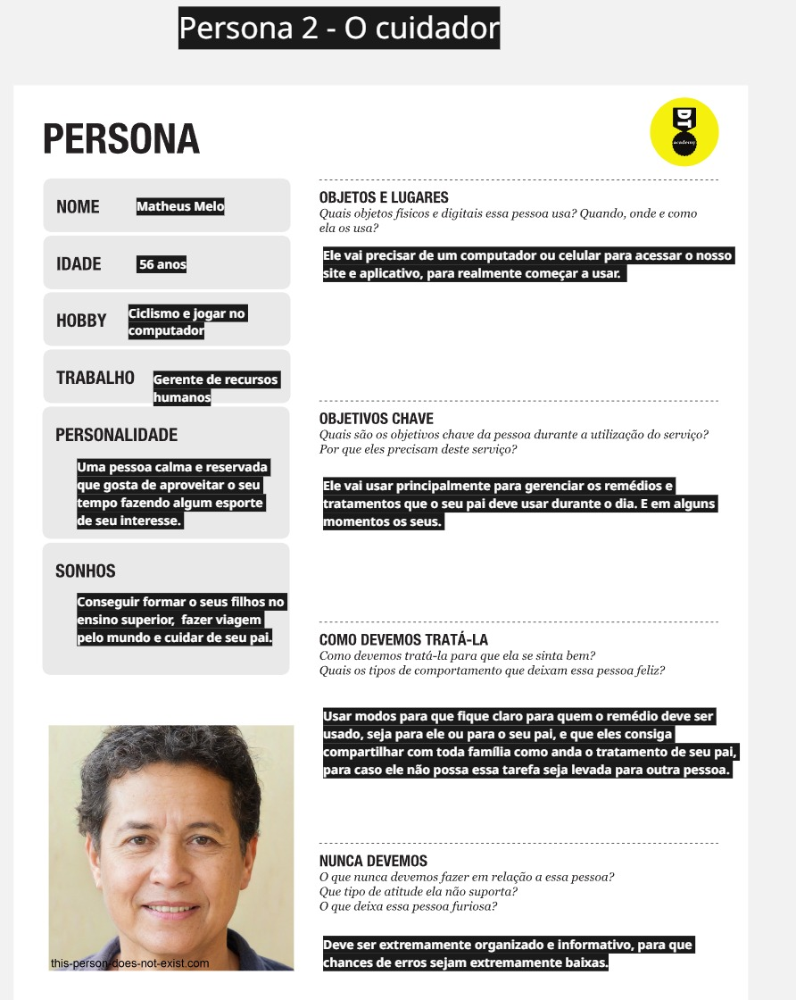;
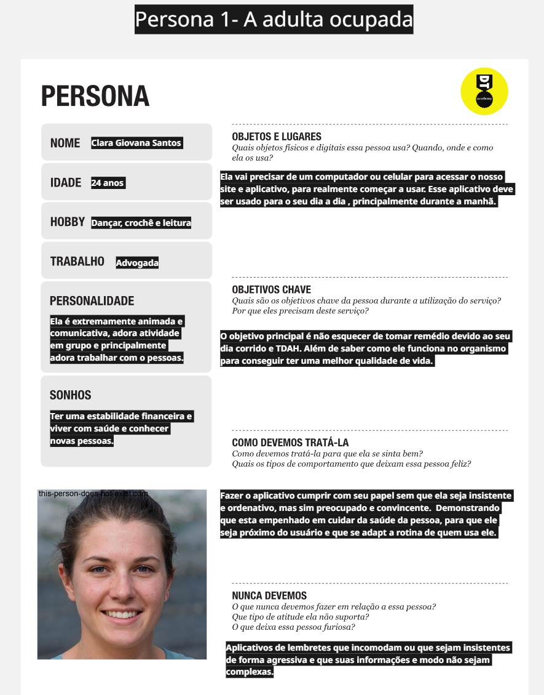;
> 
#Product Discovery

## Etapa de Entendimento

> Nessa etapa, vamos trabalhar com a metdologia de Design Thinking para compreender com maior profundidade o problema a ser tratado. Nesse processo, vamos elaborar:
> 
>* *Matriz CSD*: Também conhecida por Matriz de Alinhamento, é uma ferramenta utilizada no Design Thinking para organizar informações e facilitar o processo de tomada de decisão e solução de problemas.
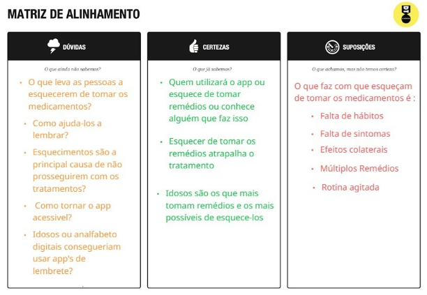
> * *Mapa de stakeholders*: Ferramenta que nos permite compreender o grupo de pessoas e entidades que devemos estudar e conversar para entender mais sobre o problema.
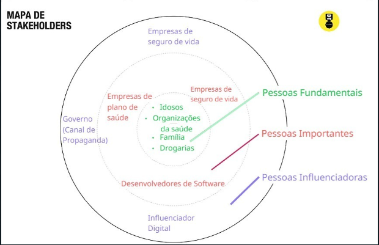
> * *Entrevistas qualitativas*: Série de entrevistas qualitativas para validar suposições e solucionar as dúvidas com as principais pessoas envolvidas.
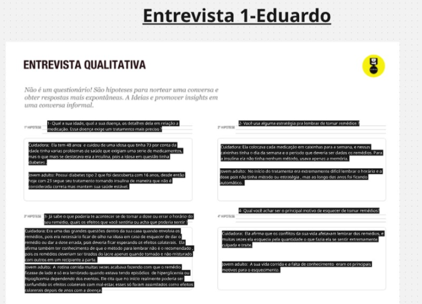
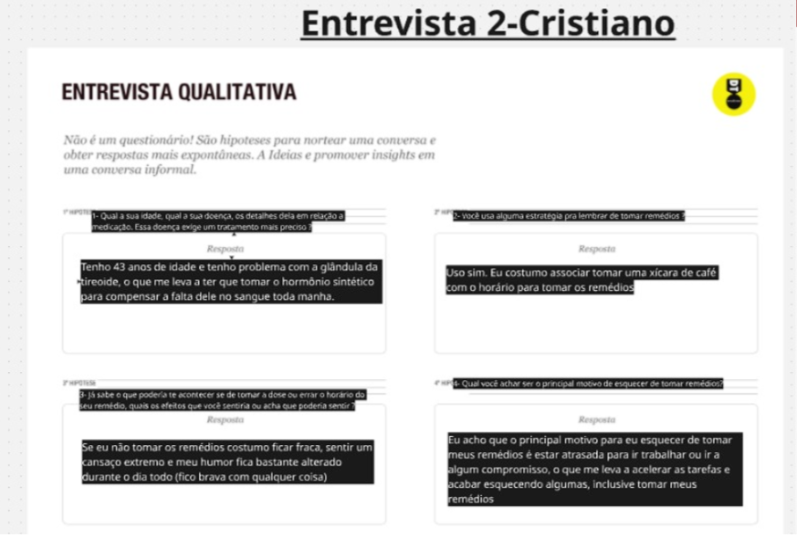
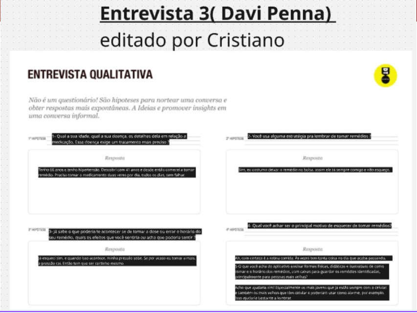
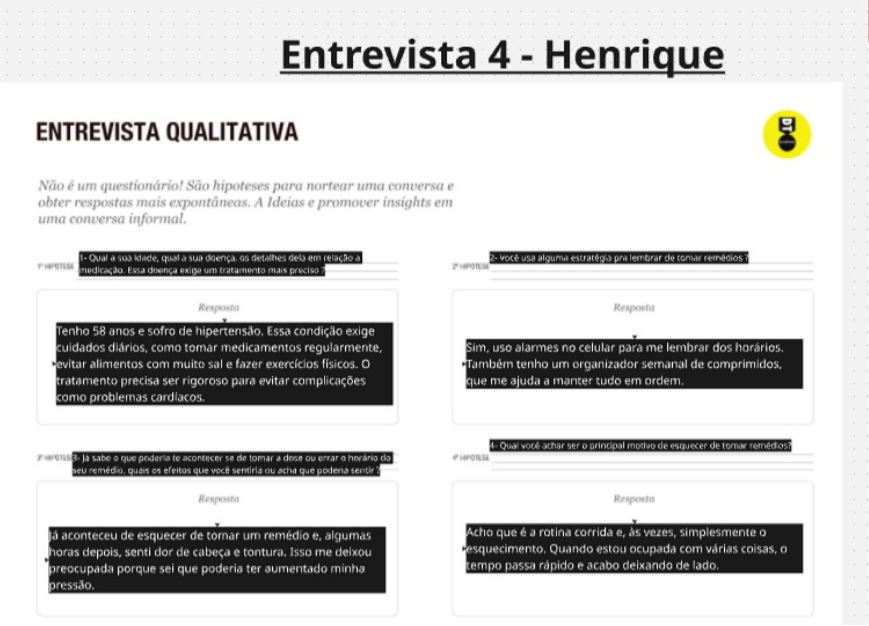
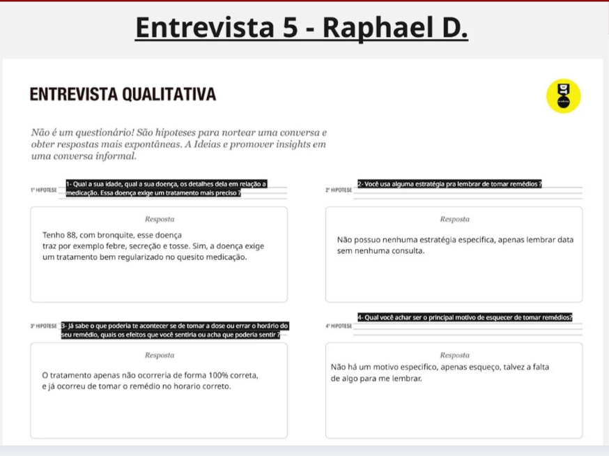
> * *Highlights de pesquisa*: Um compilado do levantamento realizado por meio das entrevistas.
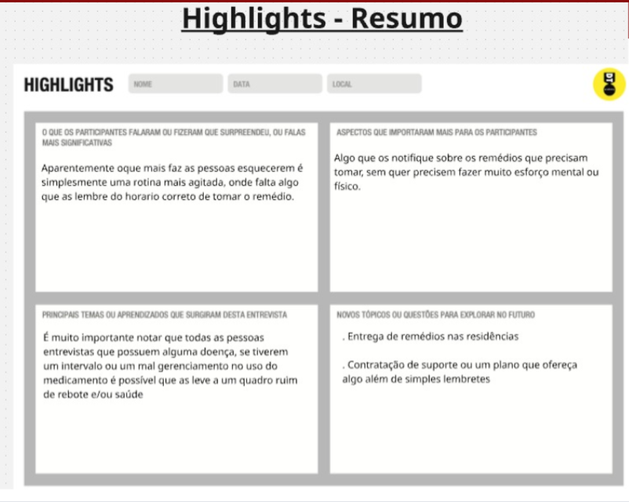
## Etapa de Definição

### Personas
Entendemos que, para a nossa aplicação, qualquer pessoa que tome remédios ou esteja em meio a um tratamento pode utilizá-la, sendo esse nosso público geral. Porém, também entendemos que nossas personas giram em torno de pessoas que tomam remédios, fazem tratamentos contínuos ou têm alguma questão de memória ou distração, o que resulta em esquecer de tomar os remédios.
Como exemplo da nossa Persona 1, temos uma mulher chamada Clara de 24 anos que, além de trabalhar e estudar, dedica-se a atividades físicas. Ela também convive com diabetes tipo 2 e tem TDAH. Essa persona é um excelente exemplo do público que se beneficiaria da nossa solução, pois sua rotina é extremamente corrida, ela lida com uma doença crônica que a acompanhará ao longo da vida e enfrenta desafios de memória e foco devido à neurodivergência. Portanto, nossa solução seria uma forma ideal de apoiá-la na organização de sua rotina e no cumprimento do seu tratamento.
Outro exemplo é a nossa Persona 2, Matheus, um homem de 56 anos que, além de trabalhar, tem a responsabilidade de cuidar de sua família. Seu pai idoso, que precisa de cuidados especiais, é quem mais exige atenção, principalmente quando se trata de medicação, já que ele precisa seguir uma série de tratamentos e tomar diversos medicamentos para manter sua saúde. Além disso, Matheus também toma alguns remédios, o que o torna um usuário em potencial para a nossa solução, que poderia ajudá-lo a gerenciar melhor tanto os cuidados com seu pai quanto os próprios tratamentos.

# Product Design

Nesse momento, vamos transformar os insights e validações obtidos em soluções tangíveis e utilizáveis. Essa fase envolve a definição de uma proposta de valor, detalhando a prioridade de cada ideia e a consequente criação de wireframes, mockups e protótipos de alta fidelidade, que detalham a interface e a experiência do usuário.

## Histórias de Usuários

Com base na análise das personas foram identificadas as seguintes histórias de usuários:

1 - Eu, a pessoa que às vezes esquece meus remédios nos momentos em que estou mais sobrecarregado ou cansado, quero poder receber notificações que me lembrem de minhas metas de saúde e motivos pra seguir o tratamento, pois assim posso ser lembrado a qualquer momento.
2 - Notificação sobre a importância de manter hábitos saudáveis, como praticar atividades físicas, que ajudam junto com o tratamento.
3 - Alertas e Notificações Inteligentes:  - Alertas com som e imagem no celular;  - Confirmação de dose (usuário marca se “tomou” ou “adiar”);  4 - Eu como alguém que esquece sempre de tomar meus remédios, queria receber notificações ao longo do dia com historias reais de pessoas que pararam de tomar e tiveram problemas, pra me dar aquele choque de realidade e não esquecer mais.
5 - Eu, a pessoa que busca melhorar minha saúde com o uso correto de remédios, quero poder ver os horários do dia em que mais esqueço ou tenho dificuldade de lembrar, assim posso me organizar melhor e evitar essas falhas.
6 - Posts falando dos riscos de parar de tomar remédio sem medico e como manter o tratamento direitinho melhora muito a qualidade de vida.
7 - Eu, como alguém que tem dificuldade em manter a rotina de remédios, queria um app que me motivasse com mensagens legais e historias de superação de outras pessoas, pra eu não desistir de tomar certinho.
8- Funcionalidades sobre:
    -Notificar o usuário quando for necessário comprar uma nova cartela de remédios ;
   - Grupo familiar de pessoas que consigam acessar e acompanhar o tratamento de um mesmo usuário;
   -Uma mesma conta consiga acompanhar o tratamento de varias pessoas diferentes (filhos acompanhando o  tratamento do pai por exemplo,).

> Orientações:
> 
>- [Histórias de usuários com exemplos e template](https://www.atlassian.com/br/agile/project-management/user-stories)
> - [Como escrever boas histórias de usuário (User Stories)](https://medium.com/vertice/como-escrever-boas-users-stories-hist%C3%B3rias-de-usu%C3%A1rios-b29c75043fac)

## Proposta de Valor

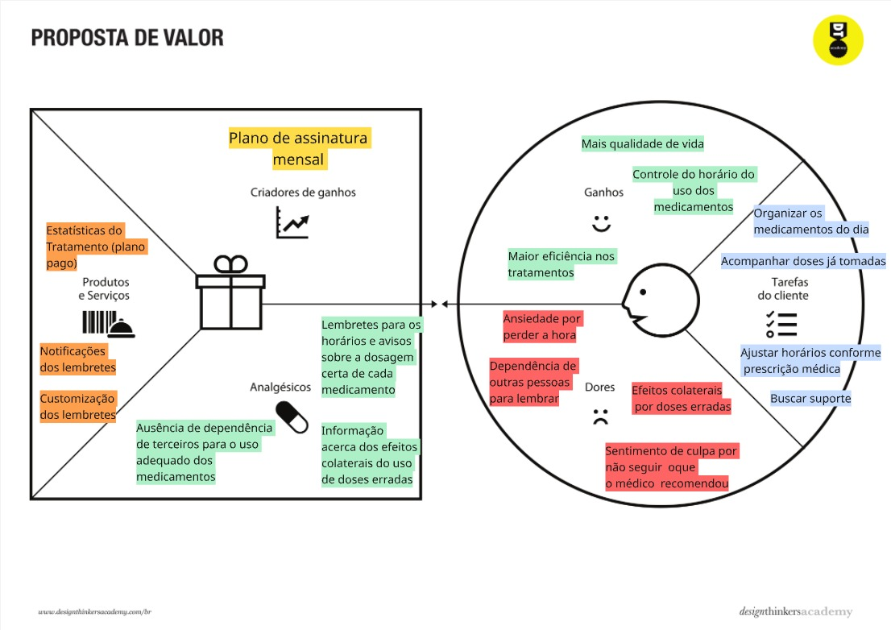

##### Proposta para Persona XPTO

## Requisitos

As tabelas que se seguem apresentam os requisitos funcionais e não funcionais que detalham o escopo do projeto.

### Requisitos Funcionais

| ID     | Descrição do Requisito                                   | Prioridade |
| ------ | ---------------------------------------------------------- | ---------- |
| RF-001 | Permitir que o usuário cadastre horários e datas | ALTA  |
| RF-002 | Emitir no final de cada mês estatísticas         | MÉDIA |
| RF-003 | Notificações personalizadas                      | ALTA  |
| RF-004 | Informação acerca dos efeitos colaterais         | BAIXA |

### Requisitos não Funcionais

| ID      | Descrição do Requisito                                                              | Prioridade |
| ------- | ------------------------------------------------------------------------------------- | ---------- |
| RNF-001 | O sistema deve ser responsivo para rodar em um dispositivos móvel| ALTA |
| RNF-002 | Facilidade de Navegação | BAIXA |
| RNF-001 | Compatibilidade com navegadores | MÉDIO |
| RNF-002 | Desempenho: Interações de no máximo 2.5 segundos | ALTA |
> 

## Projeto de Interface

### Wireframes

Estes são os protótipos de telas do sistema.

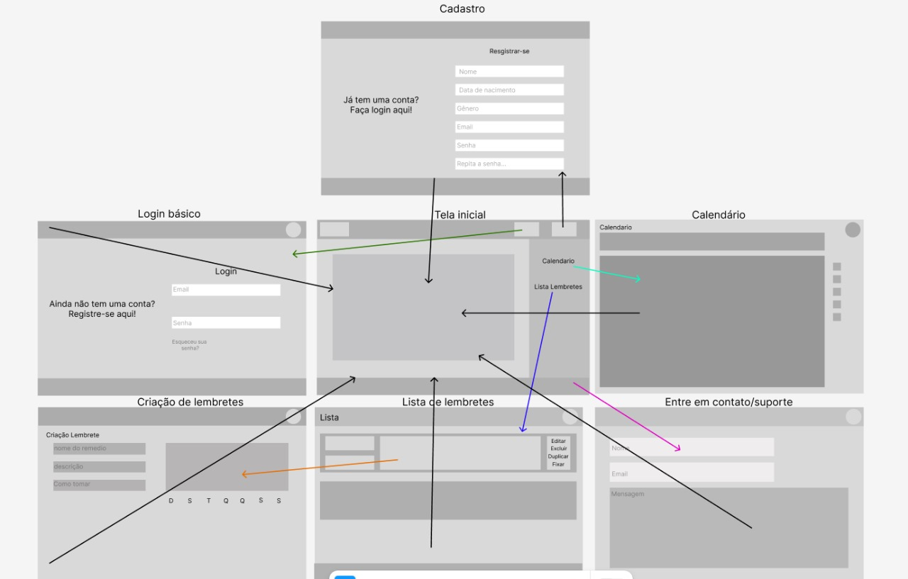

##### TELA XPTO 

Descrição para a tela XPTO

### User Flow

### Protótipo Interativo
 [Protótipo Interativo (Figma)](https://www.figma.com/proto/PRi6Jtl4xPX1nnvQmc91sr/Untitled?node-id=20-2&p=f&t=IE9kzIedYfDvG8Jd-1&scaling=min-zoom&content-scaling=fixed&page-id=0%3A1&starting-point-node-id=20%3A2)

# Metodologia

A comunicação do grupo foi centralizada no Discord, que se mostrou uma ferramenta prática para alinhar ideias, organizar reuniões e manter o contato entre integrantes com responsabilidades parecidas. O laboratório da universidade funcionou como um espaço estratégico para encontros presenciais, onde rolava a troca de ideias e o aprofundamento das pesquisas. Para garantir que todos tivessem acesso às informações e pudessem colaborar em tempo real, foram utilizados documentos compartilhados, como os do Google Docs. A distribuição das tarefas aconteceu de maneira equilibrada, respeitando a preferência e a afinidade de cada membro com as atividades. As contribuições no Miro também surgiram de forma coletiva, sendo construídas durante os momentos de troca nas aulas e reuniões do grupo.

## Ferramentas

Relação de ferramentas empregadas pelo grupo durante o projeto.

| Ambiente                    | Plataforma | Link de acesso                                                                      |
| --------------------------- | ---------- | --------------------------------------------------                                  |
| Processo de Design Thinking | Miro       | https://miro.com/app/board/uXjVITq_x2M=/?share_link_id=275512533063                 |
| Repositório de código       | GitHub     |https://github.com/ICEI-PUC-Minas-PMGCC-TI/atividade-01-grupo-lembretes-para-remedios|
| Hospedagem do site          | Render     |https://atividade-01-grupo-lembretes-para.onrender.com/index.html                    |
| Protótipo Interativo        | Figma      | https://www.figma.com/proto/PRi6Jtl4xPX1nnvQmc91sr/Untitled?node-id=20-2&p=f&t=IE9kzIedYfDvG8Jd-1&scaling=min-zoom&content-scaling=fixed&page-id=0%3A1&starting-point-node-id=20%3A2                          |
|                             |            |                                                                                     |

Ferramentas Utilizadas: 1) Editor de Codigo: VsCode
2) Ferramentas de Comunicacao: Discord e Whatsapp
3) Ferramentas de Diagramacao: Figma, Excalidraw
4) Platforma de Hospedagem: Render

## Gerenciamento do Projeto

Divisão de papéis no grupo e apresentação da estrutura da ferramenta de controle de tarefas (Kanban).

 

Nossa organização foi guiada, principalmente, por dois meios: o WhatsApp e o Kanban. Utilizávamos o Kanban como uma ferramenta visual para acompanhar o andamento das atividades que precisavam ser realizadas, permitindo que todos tivessem uma visão geral do progresso do projeto.

No entanto, raramente utilizávamos a coluna “Concluído” no Kanban, pois, para nosso grupo, essa informação não agregava tanto. Quando uma tarefa desaparecia do quadro, já entendíamos que ela havia sido finalizada, visto que a conclusão era sempre comunicada diretamente pelo WhatsApp.

Além do Kanban, uma ferramenta extremamente útil no nosso processo de organização foi o GitHub. Por meio de commits com mensagens bem explicativas, conseguimos indicar claramente o início e a finalização de cada alteração. Isso foi essencial para manter a organização do projeto e praticamente eliminou os problemas de conflito de merge, que ocorrem quando duas pessoas editam a mesma parte do código simultaneamente.

Outro fator que contribuiu bastante para a organização foi a divisão prévia de responsabilidades. Antes mesmo de começarmos o desenvolvimento do site, definimos qual página seria responsabilidade de cada integrante. Mesmo que uma página envolvesse funcionalidades de interesse de várias pessoas, ela tinha um responsável principal. Assim, qualquer alteração desejada por outros membros naquela página deveria ser previamente comunicada ao responsável, que auxiliava no processo e, se necessário, estabelecia limites para garantir o bom andamento das tarefas e evitar retrabalho.

# Solução Implementada

Esta seção apresenta todos os detalhes da solução criada no projeto.

## Vídeo do Projeto

O vídeo a seguir traz uma apresentação do problema que a equipe está tratando e a proposta de solução. ⚠️ EXEMPLO ⚠️

https://youtu.be/k8XKycWVWW8

## Funcionalidades (PRECISAMO FAZER)

Esta seção apresenta as funcionalidades da solução.Info

##### Funcionalidade 1 - Cadastro de Lembretes 

Permite a inclusão, leitura, alteração e exclusão de lembretes para o sistema

* **Estrutura de dados:** [Contatos](#ti_ed_contatos)  (PRECISAMOS FAZER) (NAO ENTENDI)
* **Instruções de acesso:**
  * Abra o site e efetue o login
  * Acesse o menu principal e escolha a opção (Criar mais 1 lembrete)
  * Em seguida, escolha a opção Sua lista de lembretes

* **Tela da funcionalidade**:

(1) titulos e descrição da funcionalidade; (2) Estrutura de dados associada; (3) o detalhe sobre as instruções de acesso e uso.

1 - 1) Index
      - API de noticias
      - Mini lista de lembretes e de calendário
    
  - 2) Crição de Lembretes
      - Nome do remédio
      - Descrição
      - Como tomar
      - Conta do usuario
      - Data
      - Horário

  - 3) Lista de Lembretes
      -Visualizar lembretes
      -Filtro por pessoa
      -Tomar
      -Editar
      -Remover

  - 4) Calendário
      - Visualizar Lembretes
      - Filtro com Data e horário para remédios iguais
      - Pop up com descricoes

   - 5) Suporte
      - Nome
      - Mensagem
      - Email
      
2 - 1) Index
    - "homeScreen": {
          "resumo": {
            "passados": [
              {
                "id": 2,
                "nome": "Paracetamol",
                "descricao": "500mg após o almoço",
                "como_tomar": "oral",
                "dependentes": "eu",
                "horario": "01:00 PM",
                "data": "2025-05-20"
              },
              {
                "id": 3,
                "nome": "Insulina",
                "descricao": "Dose de 10 unidades",
                "como_tomar": "subcutânea",
                "dependentes": "Minha mãe",
                "horario": "08:00 AM",
                "data": "2025-05-20"
              }
            ],
            "hoje": [
              {
                "id": 1,
                "nome": "Dipirona",
                "descricao": "10ml via oral",
                "como_tomar": "oral",
                "dependentes": "eu",
                "horario": "12:00 PM",
                "data": "2025-05-21"
              },
              {
                "id": 4,
                "nome": "Amoxicilina",
                "descricao": "500mg de 8 em 8 horas",
                "como_tomar": "oral",
                "dependentes": "Meu pai",
                "horario": "08:00 AM",
                "data": "2025-05-21"
              }
            ],
            "proximoDia": [
              {
                "id": 5,
                "nome": "Losartana",
                "descricao": "50mg pela manhã",
                "como_tomar": "oral",
                "dependentes": "Minha avó",
                "horario": "09:00 AM",
                "data": "2025-05-22"
              }
            ]
          }
        }
      }

    2) Criação de Lembretes:
          - "lembretes": [
              {
                "id": 1,
                "nome": "Dipirona",
                "descricao": "10ml via oral",
                "como_tomar": "oral",
                "dependentes": "eu",
                "horario": "12:00 PM",
                "data": "2025-05-21"
              },
              {
                "id": 2,
                "nome": "Paracetamol",
                "descricao": "500mg após o almoço",
                "como_tomar": "oral",
                "dependentes": "eu",
                "horario": "01:00 PM",
                "data": "2025-05-20"
              },
              {
                "id": 3,
                "nome": "Insulina",
                "descricao": "Dose de 10 unidades",
                "como_tomar": "subcutânea",
                "dependentes": "Minha mãe",
                "horario": "08:00 AM",
                "data": "2025-05-20"
              },
              {
                "id": 4,
                "nome": "Amoxicilina",
                "descricao": "500mg de 8 em 8 horas",
                "como_tomar": "oral",
                "dependentes": "Meu pai",
                "horario": "08:00 AM",
                "data": "2025-05-21"
              },
              {
                "id": 5,
                "nome": "Losartana",
                "descricao": "50mg pela manhã",
                "como_tomar": "oral",
                "dependentes": "Minha avó",
                "horario": "09:00 AM",
                "data": "2025-05-22"
              }
            ],

    4) Calendário: 
        -"eventos": [
          {
            "id": 1,
            "nome": "Dipirona",
            "descricao": "10ml via oral",
            "como_tomar": "oral",
            "dependentes": "eu",
            "horario": "12:00 PM",
            "data": "2025-05-21"
          },
          {
            "id": 2,
            "nome": "Paracetamol",
            "descricao": "500mg após o almoço",
            "como_tomar": "oral",
            "dependentes": "eu",
            "horario": "01:00 PM",
            "data": "2025-05-20"
          },
          {
            "id": 3,
            "nome": "Insulina",
            "descricao": "Dose de 10 unidades",
            "como_tomar": "subcutânea",
            "dependentes": "Minha mãe",
            "horario": "08:00 AM",
            "data": "2025-05-20"
          },
          {
            "id": 4,
            "nome": "Amoxicilina",
            "descricao": "500mg de 8 em 8 horas",
            "como_tomar": "oral",
            "dependentes": "Meu pai",
            "horario": "08:00 AM",
            "data": "2025-05-21"
          },
          {
            "id": 5,
            "nome": "Losartana",
            "descricao": "50mg pela manhã",
            "como_tomar": "oral",
            "dependentes": "Minha avó",
            "horario": "09:00 AM",
            "data": "2025-05-22"
          }
        ],

    3 e 5) Davi e Cris nao fizeram seus json 

3-  Nosso trabalho é sobre criacão de lembretes, logo:
      Ao abrir o site você verá o index, nele possuimos algums opções. O primeiro passo seria fazer registro e logar, logo após  acessar o criar lembrete, clicando nele pode-se colocar nome, data, horário, modo de tomar, descricao e o dependente. Após tê-lo criado (ou criado mais de 1 remédio ) tem-se 2 opções para prosseguir, poderá ir ao calendário e visualizar todos os lembretes já criados e sua descrição, ou se por ventura preferir editar ou excluir o lembrete criado poderá ir a aba lista de lembretes. Se tiver algum problema ou precisar de ajuda existe o botão ajuda.

## Estruturas de Dados

Descrição das estruturas de dados utilizadas na solução com exemplos no formato JSON.Info

      1- 👤 Usuários (usuarios)
          Representa os perfis de acesso ao sistema. Cada usuário possui informações de login e contato.

          {
            "id": 1,
            "login": "admin",
            "senha": "123",
            "nome": "Administrador do Sistema",
            "email": "admin@abc.com"
          }

          Atributos:
          id: Identificador único do usuário (número).
          login: Nome de usuário para login (texto).
          senha: Senha de acesso (texto).
          nome: Nome completo do usuário (texto).
          email: Endereço de e-mail (texto). 
          --------------------------------------------------

      2-⏰ Lembretes (lembretes)
          São os medicamentos agendados para serem tomados, com todos os detalhes para ajudar na organização.

          {
            "id": 1,
            "nome": "Dipirona",
            "descricao": "10ml via oral",
            "como_tomar": "oral",
            "dependentes": "eu",
            "horario": "12:00 PM",
            "data": "2025-05-21"
          }
          Atributos:
          id: Identificador único do lembrete (número).

          nome: Nome do medicamento (texto).

          descricao: Instruções ou dosagem (texto).

          como_tomar: Forma de administração (texto).

          dependentes: Para quem é o lembrete (texto).

          horario: Horário programado (texto).

          data: Data de aplicação do lembrete (formato: AAAA-MM-DD).
          -----------------------------------------------------

      3-📅 Eventos (eventos)
        Estrutura semelhante a lembretes, mas usada especificamente para exibição no calendário. Serve como base para renderizar os lembretes dentro da agenda.

        {
          "id": 3,
          "nome": "Insulina",
          "descricao": "Dose de 10 unidades",
          "como_tomar": "subcutânea",
          "dependentes": "Minha mãe",
          "horario": "08:00 AM",
          "data": "2025-05-20"
        }
        Observação: A estrutura dos eventos é idêntica à de lembretes, podendo ser gerada automaticamente a partir deles.
        -------------------------------------------------------------

      4-  🏠 Tela Inicial (homeScreen)
          Essa estrutura centraliza os lembretes organizados por data (passados, de hoje e futuros) para facilitar o resumo visual na tela inicial do sistema.

          {
            "resumo": {
              "passados": [...],
              "hoje": [...],
              "proximoDia": [...]
            }
          }
          Cada lista contém objetos no mesmo formato da estrutura lembretes.

          Atributos:
          resumo: Objeto contendo listas de lembretes separados por:

          passados: Lembretes com data anterior ao dia atual.

          hoje: Lembretes marcados para o dia atual.

          proximoDia: Lembretes marcados para o dia seguinte.

## Módulos e APIs 

Esta seção apresenta os módulos, bibliotecas e APIs utilizados no desenvolvimento da solução.

Bibliotecas e Frameworks:
jQuery - Biblioteca JavaScript para manipulação do DOM e eventos.
[https://jquery.com/](https://jquery.com/)
API de Calendário - Disponibilizada pelo professores de diw
Bootstrap (CSS Reset) - Utilizado para facilitar estilos em alguns componentes (se estiver usando em outras partes).
[https://getbootstrap.com/](https://getbootstrap.com/)
 Api de Notícias  - Utilizado para mostrar notícias relacionadas a saúde
[https://newsapi.org/]
Biblioteca: "All articles mentioning Apple from yesterday, sorted by popular publishers first"

APIs e Fontes de Dados:
Armazenamento local (localStorage) - Os lembretes são armazenados e recuperados diretamente do navegador do usuário, sem uso de uma API externa.

Imagens e Mídia:
Imagens locais - Logotipo e demais imagens usadas são hospedadas localmente na pasta /img.

# Referências 
>
LYNCH, S. Aderência ao tratamento medicamentoso. Disponível em: https://www.msdmanuals.com/pt/casa/medicamentos/fatores-que-afetam-a-resposta-medicamentosa/ader%C3%AAncia-ao-tratamento-medicamentoso. Acesso em: 22 jun. 2025.

ROCHA, Andréa Soares da; RIBEIRO, Iara Siqueira de Lima; OLIVEIRA, Renata Coelho de; et al. Dificuldades no uso de medicamentos por idosos acompanhados em uma coorte do Sul do Brasil. Revista Brasileira de Epidemiologia, v. 26, 2023. DOI: 10.1590/1980-549720230020.2. Disponível em: https://www.scielo.br/j/rbepid/a/fsM3pN6YmXXWLXhgM5MBZMh/?lang=pt. Acesso em: 22 jun. 2025.

SOBRAL, Pollyanna Dutra; OLIVEIRA, Dinaldo Cavalcanti; GOMES, Eduardo Tavares; CARVALHO, Priscila de Oliveira; BRITO, Norma Maria Tenório; OLIVEIRA, Danielle Aparecida Gomes Cavalcanti de; ARAGÃO, Erlley Raquel; GODOI, Emanuelle Tenório. Razões para não adesão a fármacos em pacientes com doença arterial coronariana. Revista da Sociedade Brasileira de Clínica Médica, v. 15, n. 3, p. 166-170, 2017. Disponível em: https://www.revista.sbcm.org.br/index.php/rsbcm/article/view/288. Acesso em: 22 jun. 2025.

LEITE, S. N.; VASCONCELLOS, M. P. C. A adesão à terapêutica medicamentosa: elementos para a discussão de conceitos e pressupostos adotados. Ciência & Saúde Coletiva, v. 8, n. 3, p. 775-782, 2003.
Disponível em: https://www.scielo.br/j/csc/a/ynpCtZ8FqC9r5PQ3PvYPgsc/?lang=pt. Acesso em: 22 jun. 2025.

CARVALHO, D. R.; BORGES, A. P.; SOARES, D. A. R.; et al. Aderência ao tratamento medicamentoso em idosos hipertensos. Revista de Saúde Pública, v. 44, n. 3, p. 620-628, 2010.
Disponível em: https://www.scielo.br/j/rsp/a/BhHnHcHQHRtYGHWzZMXhNJM/?lang=pt. Acesso em: 22 jun. 2025.

MORAES, E. N.; et al. Fatores associados à não adesão ao tratamento medicamentoso em idosos. Revista Brasileira de Geriatria e Gerontologia, v. 15, n. 3, p. 485-494, 2012.
Disponível em: https://www.scielo.br/j/rbgg/a/Q4VJnXTjNy7zcrDDfbjFNHF/?lang=pt. Acesso em: 22 jun. 2025.

GOMES, M. A.; COSTA, M. A.; MACHADO, J. C. Fatores que influenciam a adesão ao tratamento medicamentoso em pacientes crônicos. Revista de Enfermagem UFPE on line, v. 7, n. 9, p. 5944-5951, 2013.
Disponível em: https://periodicos.ufpe.br/revistas/revistaenfermagem/article/view/11840. Acesso em: 22 jun. 2025.

MORAES, R. O.; et al. Barreiras e facilitadores para adesão ao tratamento medicamentoso em hipertensos e diabéticos: estudo em unidade de saúde da família. Revista da Escola de Enfermagem da USP, v. 48, n. 5, p. 839-845, 2014.
Disponível em: https://www.scielo.br/j/reeusp/a/YX9fNn9dBg3cYPK3vX3jPYF/?lang=pt. Acesso em: 22 jun. 2025.